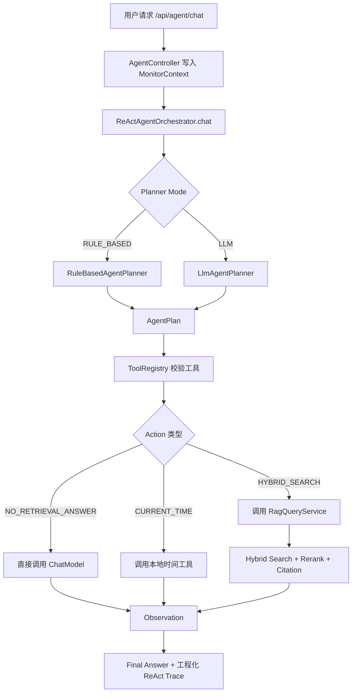

# ReAct Agent 推理循环实现细节

## 1. 阶段定位

本阶段目标是把原来的单一路径问答升级为 ReAct Agent 推理循环，让 Agent 在回答前先判断任务类型，再决定是否直接回答、调用工具或检索知识库。

本次优化在第一版 ReAct 基础上补齐三块工程能力：

1. 工程化 ReAct Trace：增加 `needRetrieval`、`actionReason`、`confidence`，支持调试 Agent 决策链路。
2. Tool Registry：把 `CURRENT_TIME`、`HYBRID_SEARCH`、`NO_RETRIEVAL_ANSWER` 抽象成统一工具定义。
3. 可选 LLM Planner：默认使用规则 Planner，配置开启后由大模型判断是否检索、是否调用工具以及为什么这么选。

## 2. 目录层次

```text
优化/
└─ 01-ReAct-Agent推理循环/
   ├─ 实现细节.md
   ├─ ReAct-Agent接口测试.postman_collection.json
   └─ ReAct-Agent通用测试知识库.md
```

工程代码目录：

```text
src/main/java/com/lou/infinitechatagent/
├─ agent/
│  ├─ ReActAgentOrchestrator.java
│  ├─ planner/
│  │  ├─ AgentPlanner.java
│  │  ├─ RuleBasedAgentPlanner.java
│  │  └─ LlmAgentPlanner.java
│  ├─ tool/
│  │  └─ ToolRegistry.java
│  └─ dto/
│     ├─ AgentAction.java
│     ├─ AgentActionType.java
│     ├─ AgentObservation.java
│     ├─ AgentPlan.java
│     ├─ AgentRequest.java
│     ├─ AgentResponse.java
│     ├─ AgentTool.java
│     └─ ReActStep.java
└─ controller/
   └─ AgentController.java
```

## 3. 接口设计

Agent 对话接口：

```http
POST /api/agent/chat
Content-Type: application/json
```

请求体：

```json
{
  "userId": 1001,
  "sessionId": 91003,
  "prompt": "ORDER-409 是什么原因？请给出引用。"
}
```

工具注册表接口：

```http
GET /api/agent/tools
```

响应体核心字段：

```json
{
  "answer": "回答：...",
  "strategy": "REACT_HYBRID_RAG",
  "citations": [],
  "reactTrace": [
    {
      "step": 1,
      "thought": "问题包含企业知识、错误码、配置项、接口名或引用诉求，需要检索知识库。",
      "needRetrieval": true,
      "actionReason": "问题包含企业知识、错误码、配置项、接口名或引用诉求，需要检索知识库。",
      "confidence": 0.86,
      "action": {
        "type": "HYBRID_SEARCH",
        "toolName": "hybrid_search",
        "query": "ORDER-409 是什么原因？请给出引用。",
        "arguments": {
          "reasonCode": "knowledge_or_identifier_matched",
          "riskLevel": "LOW",
          "toolDescription": "调用企业知识库 Hybrid RAG，执行向量检索、关键词检索、RRF 融合、重排序和引用溯源。"
        }
      },
      "observation": {
        "success": true,
        "summary": "hybrid search retrieved=5, candidates=20, citations=5",
        "citationCount": 5,
        "costMs": 3500
      }
    }
  ]
}
```

## 4. ReAct 推理循环

当前采用 Planner + Tool Registry + Executor 架构：



## 5. 工程化 Trace

`ReActStep` 字段：

| 字段 | 含义 | 用途 |
| --- | --- | --- |
| `thought` | 当前步骤的推理意图 | 解释 Agent 下一步想做什么 |
| `needRetrieval` | 是否需要检索知识库 | 判断路由是否正确 |
| `actionReason` | 选择动作的原因 | 调试 Planner 决策链路 |
| `confidence` | Planner 置信度 | 后续可用于低置信度追问或二次规划 |
| `action` | 实际执行动作 | 记录工具名、查询和参数 |
| `observation` | 动作执行结果 | 记录成功状态、引用数量和耗时 |

这组字段让接口不仅返回答案，还能解释为什么走这条路径，适合后续做 Agent 调试面板、调用审计和线上问题排查。

## 6. Tool Registry

`ToolRegistry` 统一维护可调用工具元信息。

| name | actionType | description | riskLevel | enabled |
| --- | --- | --- | --- | --- |
| `current_time` | `CURRENT_TIME` | 查询 Asia/Shanghai 当前日期和时间 | `LOW` | `true` |
| `hybrid_search` | `HYBRID_SEARCH` | 调用企业知识库 Hybrid RAG | `LOW` | `true` |
| `direct_answer` | `NO_RETRIEVAL_ANSWER` | 不调用外部工具或知识库，直接回答 | `LOW` | `true` |

当前 Tool Registry 先写成内存注册表，后续可以扩展为数据库配置或 YAML 配置。

后续扩展方向：

- 邮件工具：`send_email`，风险等级 `MEDIUM`。
- 数据库工具：`query_database`，风险等级 `MEDIUM` 或 `HIGH`。
- MCP 工具：按 MCP server 和 toolName 注册。
- 多 Agent 工具：如 `research_agent`、`memory_agent`、`tool_agent`。
- 安全护轨：根据 `riskLevel` 决定是否需要人工确认。

## 7. Planner 策略

### 7.1 RuleBasedAgentPlanner

默认使用规则 Planner，稳定、省钱、延迟低。

触发知识库检索的条件：

- 包含 `知识库`、`根据文档`、`引用`、`来源`。
- 包含 `RAG`、`PgVector`、`Redis`、`MCP`、`MemoryId`。
- 包含 `错误码`、`配置`、`接口`、`类名`、`流程`、`架构`。
- 命中错误码或技术标识符模式，如 `ORDER-409`、`OrderFulfillmentService.confirmOrder`、`@Tool`。

触发时间工具的条件：

- `现在几点`
- `当前时间`
- `今天日期`
- `current time`
- `now`

其余问题走直接回答。

### 7.2 LlmAgentPlanner

配置开启后，系统先调用大模型进行动作规划。LLM Planner 只负责输出结构化 JSON，不直接回答用户问题。

LLM 输出格式：

```json
{
  "actionType": "HYBRID_SEARCH",
  "needRetrieval": true,
  "actionReason": "用户问题包含错误码，需要检索企业知识库。",
  "confidence": 0.88
}
```

系统会把 `actionType` 映射到 Tool Registry，避免模型调用未注册工具。如果 LLM 输出无法解析、动作不存在或工具被禁用，自动 fallback 到规则 Planner，并把 `plannerType` 标记为 `RULE_BASED_FALLBACK`。

## 8. 与现有 RAG 的关系

ReAct 的 `HYBRID_SEARCH` 不重新实现检索，而是复用：

- `RagQueryService.chatWithCitations`
- `HybridSearchService`
- `VectorSearchService`
- `KeywordSearchService`
- `RuleBasedRerankService`
- Redis 会话记忆
- 引用溯源 DTO

因此原有 `/api/rag/chat` 仍可单独使用，新接口 `/api/agent/chat` 是更上层的 Agent 编排入口。

## 9. 配置项

```yaml
agent:
  react:
    max-output-tokens: 500
    memory-max-messages: 20
    planner:
      mode: ${AGENT_REACT_PLANNER_MODE:RULE_BASED}
      max-output-tokens: 300
```

说明：

- `max-output-tokens` 控制直接回答路径的最大输出长度。
- `memory-max-messages` 控制 ReAct 直接回答和工具调用路径写入 Redis 的窗口大小。
- `planner.mode` 控制 Planner 模式，支持 `RULE_BASED` 和 `LLM`。
- `planner.max-output-tokens` 控制 LLM Planner 的最大输出长度。
- RAG 路径仍使用 `rag.citation.max-output-tokens`。

## 10. Postman 测试

导入集合：

```text
优化/01-ReAct-Agent推理循环/ReAct-Agent接口测试.postman_collection.json
```

测试用例：

| 用例 | 请求 | 预期 |
| --- | --- | --- |
| 工具注册表 | `GET /api/agent/tools` | 返回 `current_time`、`hybrid_search`、`direct_answer` |
| 直接回答 | `你好，帮我把这句话润色一下：系统已经完成升级。` | `strategy=REACT_DIRECT`，`needRetrieval=false` |
| 工具调用 | `现在几点？` | `strategy=REACT_TOOL`，`toolName=current_time` |
| 错误码检索 | `ORDER-409 是什么原因？请给出引用。` | `strategy=REACT_HYBRID_RAG`，返回引用 |
| 配置项检索 | `warehouse.retry.interval-seconds 有什么作用？` | `action.type=HYBRID_SEARCH` |

注意：新增测试知识库文件需要被文档导入或向量化后，错误码和配置项测试才能稳定返回引用。

## 11. 验收标准

- `/api/agent/chat` 返回 `reactTrace`。
- `reactTrace[0]` 包含 `thought`、`needRetrieval`、`actionReason`、`confidence`、`action`、`observation`。
- `action.toolName` 能对应 Tool Registry 中的工具。
- `/api/agent/tools` 能查看已注册工具。
- 默认配置下不增加额外 Planner 模型调用。
- 设置 `AGENT_REACT_PLANNER_MODE=LLM` 后，由大模型输出动作计划。
- LLM Planner 失败时自动 fallback 到规则 Planner。

## 12. 后续优化接口预留

下一阶段可以继续扩展：

- Adaptive RAG：LLM 判断是否检索、检索哪个知识库、使用哪种检索策略。
- 多轮检索：首次证据不足时自动 query rewrite + 二次检索。
- Memory Agent：基于对话摘要维护长期用户偏好和任务状态。
- 多 Agent 协作：把研究、工具调用、记忆、审核拆成不同 Agent。
- Tool Guardrail：结合 `riskLevel` 实现人工确认和审计。

## 13. 简历表达建议

可以写成：

> 设计并实现 ReAct Agent 推理循环，在原有 RAG 问答基础上引入 Thought-Action-Observation 编排机制，并扩展 `needRetrieval`、`actionReason`、`confidence` 等可观测字段，支持调试 Agent 决策链路；通过 Tool Registry 统一管理工具名称、描述、风险等级与启用状态，并提供规则 Planner / LLM Planner 双模式，使 Agent 能在直接回答、工具调用与知识库检索之间自主路由，为 Adaptive RAG、多轮补充检索和多 Agent 协作提供统一编排入口。
