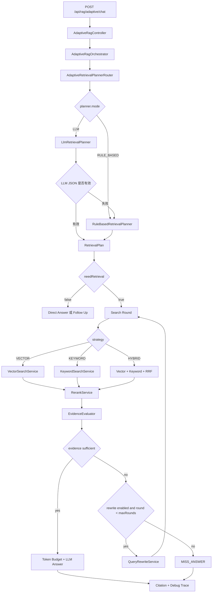

# 阶段二 Adaptive RAG 完整技术文档

## 1. 阶段目标

阶段二的目标是将原有固定 RAG 流程升级为 Adaptive RAG，让系统不再机械执行“检索 -> 拼 Prompt -> 回答”，而是根据问题和证据质量动态决策：

1. 是否需要检索。
2. 使用哪种检索策略：`NO_RETRIEVAL`、`FOLLOW_UP_REQUIRED`、`VECTOR`、`KEYWORD`、`HYBRID`。
3. 检索 query 如何生成。
4. 召回 TopK 与 rerank TopK 如何设置。
5. 检索证据是否足够回答。
6. 证据不足时是否 query rewrite。
7. 是否需要多轮补充检索。
8. 是否应拒答或追问。

阶段二最终形成了一条完整链路：

```text
Retrieval Planner -> Search -> Rerank -> Evidence Evaluator -> Query Rewrite -> Multi-Round Retrieval -> Answer + Citation + Debug Trace
```

## 2. 当前完成范围

| 阶段 | 能力 | 状态 |
| --- | --- | --- |
| 2.1 | Adaptive RAG 基础闭环 | 已完成 |
| 2.2 | Evidence Evaluator 证据评估 | 已完成 |
| 2.3 | Query Rewrite + 多轮补充检索 | 已完成 |
| 2.4 | LLM Retrieval Planner | 已完成 |

## 3. 架构图



## 4. 接口设计

### 4.1 Adaptive RAG Chat

```http
POST /api/rag/adaptive/chat
Content-Type: application/json
```

请求体：

```json
{
  "userId": 1001,
  "sessionId": 92001,
  "prompt": "ORDER-409 是什么原因？请给出引用。",
  "debug": true
}
```

### 4.2 debug=false 响应

面向业务调用方，只返回用户态必要字段。

```json
{
  "answer": "回答：...",
  "citations": [],
  "hit": true,
  "strategy": "ADAPTIVE_KEYWORD",
  "rounds": 1
}
```

### 4.3 debug=true 响应

面向开发、调试、演示和验收，返回完整决策链路。

```json
{
  "answer": "回答：...",
  "citations": [],
  "hit": true,
  "strategy": "ADAPTIVE_HYBRID",
  "rounds": 2,
  "debug": {
    "retrievalPlan": {
      "needRetrieval": true,
      "knowledgeBase": "agent_docs",
      "strategy": "HYBRID",
      "query": "ORDER-504 仓储系统超时 延迟队列 重试配置",
      "vectorTopK": 20,
      "keywordTopK": 20,
      "rerankTopK": 5,
      "reason": "问题包含错误码和处理建议，需要同时使用关键词与语义检索。",
      "confidence": 0.88
    },
    "adaptiveTrace": [
      {
        "round": 1,
        "query": "ORDER-504 怎么处理？",
        "strategy": "KEYWORD",
        "candidateCount": 3,
        "retrievedCount": 3,
        "evidenceSufficient": false,
        "topScore": 0.31,
        "coverageScore": 0.0,
        "missingAspects": ["required_terms_not_covered"],
        "rewritten": true,
        "rewriteReason": "根据证据缺失项和已召回片段补充检索关键词。"
      },
      {
        "round": 2,
        "query": "ORDER-504 怎么处理？ ORDER-504 超时 重试 处理建议",
        "strategy": "KEYWORD",
        "candidateCount": 8,
        "retrievedCount": 5,
        "evidenceSufficient": true
      }
    ],
    "evidenceEvaluation": {
      "sufficient": true,
      "topScore": 0.82,
      "coverageScore": 1.0,
      "citationCount": 5,
      "missingAspects": [],
      "shouldRewrite": false,
      "shouldAskFollowUp": false,
      "reason": "召回证据满足当前问题回答要求。"
    },
    "queryRewrites": [
      {
        "rewritten": true,
        "originalQuery": "ORDER-504 怎么处理？",
        "rewrittenQuery": "ORDER-504 怎么处理？ 超时 重试 处理建议",
        "reason": "根据证据缺失项和已召回片段补充检索关键词。",
        "addedTerms": ["超时", "重试", "处理建议"]
      }
    ],
    "cost": {
      "totalMs": 3200,
      "retrievalMs": 300,
      "modelMs": 2800
    },
    "token": {
      "estimatedInputTokens": 1200,
      "contextTruncated": false
    },
    "scoreDetails": []
  }
}
```

## 5. 核心模块

### 5.1 AdaptiveRagOrchestrator

核心编排器，负责：

- 调用 Retrieval Planner。
- 执行检索策略。
- 调用 Rerank。
- 调用 Evidence Evaluator。
- 在证据不足时触发 Query Rewrite。
- 控制最大检索轮数。
- 生成最终回答、citation 和 debug trace。

### 5.2 Retrieval Planner

接口：

```java
public interface RetrievalPlanner {
    RetrievalPlan plan(AdaptiveRagRequest request);
}
```

实现：

- `RuleBasedRetrievalPlanner`
- `LlmRetrievalPlanner`
- `AdaptiveRetrievalPlannerRouter`

### 5.3 RuleBasedRetrievalPlanner

规则：

| 条件 | strategy |
| --- | --- |
| 空问题 | `NO_RETRIEVAL` |
| 模糊错误且无错误码 | `FOLLOW_UP_REQUIRED` |
| 普通闲聊、润色 | `NO_RETRIEVAL` |
| 错误码、配置项、类名、方法名 | `KEYWORD` |
| 为什么、是什么、解释、流程、架构 | `VECTOR` |
| 其他知识库问题 | `HYBRID` |

### 5.4 LlmRetrievalPlanner

LLM 输出结构化 JSON：

```json
{
  "needRetrieval": true,
  "knowledgeBase": "agent_docs",
  "strategy": "HYBRID",
  "query": "ORDER-504 仓储系统超时 延迟队列 重试配置",
  "vectorTopK": 20,
  "keywordTopK": 20,
  "rerankTopK": 5,
  "reason": "问题包含错误码和处理建议，需要同时使用关键词与语义检索。",
  "confidence": 0.88
}
```

异常情况自动 fallback 到 `RuleBasedRetrievalPlanner`。

### 5.5 EvidenceEvaluator

接口：

```java
public interface EvidenceEvaluator {
    EvidenceEvaluation evaluate(String question, RetrievalPlan plan, List<RetrievedChunk> chunks);
}
```

当前实现：`RuleBasedEvidenceEvaluator`。

判断维度：

- 是否召回 chunk。
- Top score 是否达标。
- citation 数量是否达标。
- 错误码是否被召回片段覆盖。
- 配置项是否被召回片段覆盖。
- 关键实体覆盖率是否达标。

### 5.6 QueryRewriteService

接口：

```java
public interface QueryRewriteService {
    QueryRewriteResult rewrite(String question,
                               RetrievalPlan plan,
                               EvidenceEvaluation evaluation,
                               List<RetrievedChunk> previousChunks);
}
```

当前实现：`RuleBasedQueryRewriteService`。

改写来源：

- 用户问题中的错误码、配置项。
- `missingAspects` 中的缺失实体。
- 上一轮召回片段中的错误码、配置项。
- 文件名关键词。
- 通用错误处理提示词，如 `超时`、`重试`、`处理建议`。

## 6. 配置项

```yaml
rag:
  adaptive:
    enabled: true
    knowledge-base: agent_docs
    max-output-tokens: 500
    memory-max-messages: 20
    max-rounds: 2
    planner:
      mode: ${RAG_ADAPTIVE_PLANNER_MODE:RULE_BASED}
      max-output-tokens: 300
    retrieval:
      vector-top-k: 20
      keyword-top-k: 20
      rerank-top-k: 5
    evidence:
      min-top-score: 0.45
      min-coverage-score: 0.5
      min-citations: 1
    rewrite:
      enabled: true
```

## 7. Postman 完整测试接口

完整集合：

```text
E:\Java\Agent\InfiniteChat-Agent-Docs\优化\02-Adaptive-RAG\Adaptive-RAG接口测试.postman_collection.json
```

### 7.1 错误码关键词检索

```http
POST {{baseUrl}}/rag/adaptive/chat
```

```json
{
  "userId": 1001,
  "sessionId": 92001,
  "prompt": "ORDER-409 是什么原因？请给出引用。",
  "debug": true
}
```

预期：

- `debug.retrievalPlan.strategy = KEYWORD`
- 返回 `debug.evidenceEvaluation`
- 命中时返回 citations

### 7.2 配置项关键词检索

```json
{
  "userId": 1001,
  "sessionId": 92002,
  "prompt": "warehouse.retry.interval-seconds 有什么作用？",
  "debug": true
}
```

预期：

- `debug.retrievalPlan.strategy = KEYWORD`
- `debug.adaptiveTrace[0].candidateCount` 存在
- `topScore`、`coverageScore` 存在

### 7.3 语义类向量检索

```json
{
  "userId": 1001,
  "sessionId": 92003,
  "prompt": "为什么 RAG 回答需要引用来源？",
  "debug": true
}
```

预期：

- `debug.retrievalPlan.strategy = VECTOR`
- `debug.evidenceEvaluation.sufficient` 存在

### 7.4 模糊错误追问

```json
{
  "userId": 1001,
  "sessionId": 92004,
  "prompt": "这个错误怎么处理？",
  "debug": true
}
```

预期：

- `debug.retrievalPlan.strategy = FOLLOW_UP_REQUIRED`
- `hit = false`
- 回答要求用户补充错误码、配置项或业务对象

### 7.5 普通问题不检索

```json
{
  "userId": 1001,
  "sessionId": 92005,
  "prompt": "你好，帮我润色一句话：系统已经完成升级。",
  "debug": true
}
```

预期：

- `debug.retrievalPlan.strategy = NO_RETRIEVAL`
- 不进入检索

### 7.6 debug=false 隐藏调试字段

```json
{
  "userId": 1001,
  "sessionId": 92006,
  "prompt": "你好，帮我润色一句话：系统已经完成升级。",
  "debug": false
}
```

预期：

- 返回 `answer`
- 返回 `citations`
- 返回 `hit`
- 返回 `strategy`
- 返回 `rounds`
- 不返回 `debug`

### 7.7 Query Rewrite 多轮检索

```json
{
  "userId": 1001,
  "sessionId": 92007,
  "prompt": "ORDER-504 怎么处理？",
  "debug": true
}
```

预期：

- 返回 `debug.queryRewrites`
- `rounds = debug.adaptiveTrace.length`
- 证据不足时最多执行 `rag.adaptive.max-rounds` 轮

### 7.8 LLM Retrieval Planner 模式

启动服务前设置：

```powershell
$env:RAG_ADAPTIVE_PLANNER_MODE="LLM"
```

请求：

```json
{
  "userId": 1001,
  "sessionId": 92008,
  "prompt": "ORDER-504 怎么处理？",
  "debug": true
}
```

预期：

- `debug.retrievalPlan` 存在
- `debug.retrievalPlan.query` 不为空
- `debug.retrievalPlan.strategy` 属于允许枚举

## 8. 验收标准

- 默认使用 RuleBased Retrieval Planner。
- 可通过 `RAG_ADAPTIVE_PLANNER_MODE=LLM` 开启 LLM Retrieval Planner。
- LLM Planner 失败时 fallback 到规则 Planner。
- 证据不足时不强行回答。
- 证据不足且允许改写时执行 query rewrite。
- 多轮检索受 `max-rounds` 限制。
- `debug=true` 返回完整决策链路。
- `debug=false` 隐藏内部调试字段。
- 编译通过：`.\mvnw.cmd -q -DskipTests package`。

## 9. 简历表述

推荐写法：

> 设计并实现 Adaptive RAG 检索决策框架，在 ReAct Agent 基础上引入 Retrieval Planner、Evidence Evaluator、Query Rewrite 和多轮补充检索机制；支持规则 Planner / LLM Retrieval Planner 双模式，能动态判断是否检索、选择 Vector/Keyword/Hybrid 策略、生成检索 query 与 TopK 参数，并在证据不足时根据缺失项自动改写查询进行补充检索；接口返回 citation 与 debug trace，实现检索决策、证据评估、改写过程和耗时指标的全链路可观测。
