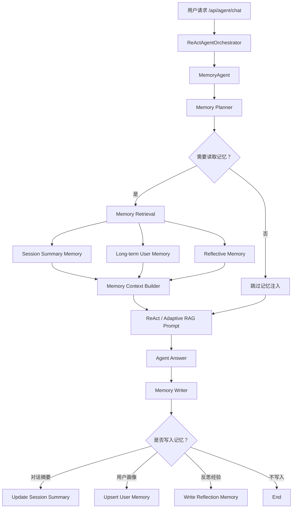

# 阶段三 Memory Agent 总体技术路线

## 1. 阶段目标

当前项目已经具备：

- ReAct Agent 推理循环
- Tool Registry
- Rule / LLM Planner
- Citation RAG
- Hybrid Search
- Rerank
- Adaptive RAG
- Evidence Evaluator
- Query Rewrite
- 多轮补充检索

阶段三目标是在现有 Redis 短期会话记忆基础上，引入更完整的 Memory Agent 能力，让 Agent 具备：

1. 长程多轮对话能力。
2. 对话摘要记忆能力。
3. 长期用户画像记忆能力。
4. 反思记忆能力。
5. 记忆读取、写入、更新、清理的统一编排能力。
6. 在 ReAct / Adaptive RAG 中按需注入记忆上下文。

最终目标是让系统从“能检索知识库的 Agent”升级为“能记住用户、总结上下文、反思交互并持续优化的 Agent”。

## 2. 简历定位

推荐简历表述：

> 设计并实现 Memory Agent 记忆增强模块，在 Redis 短期会话记忆基础上引入对话摘要、长期用户画像和反思记忆机制；通过 Memory Planner 自动判断记忆读取与写入时机，结合摘要压缩、结构化记忆存储、相似记忆检索与低置信度交互复盘，实现长程多轮对话、个性化上下文注入和 Agent 行为持续优化，并降低上下文 Token 成本。

## 3. 总体架构



## 4. Memory 分层设计

### 4.1 Short-Term Memory

现状已有 Redis 会话记忆。

用途：

- 保存最近 N 轮对话。
- 支持短程上下文连续。
- 适合 `/chat`、`/streamChat`、`/rag/chat`、`/agent/chat` 的即时多轮对话。

问题：

- 长对话会增加 Token 成本。
- Redis TTL 后记忆消失。
- 无法沉淀用户长期偏好。
- 无法总结失败经验。

### 4.2 Session Summary Memory

对话摘要记忆。

用途：

- 每 N 轮对话生成摘要。
- 保留任务目标、已确认事实、未完成事项、关键约束。
- 后续对话注入摘要，而不是注入所有历史消息。

示例：

```json
{
  "sessionId": 92001,
  "userId": 1001,
  "summary": "用户正在开发 Java + LangChain4j 的 Agent 项目，已完成 ReAct 和 Adaptive RAG，下一步关注 Memory Agent。",
  "turnCount": 12,
  "updatedAt": "2026-04-28T20:30:00"
}
```

### 4.3 Long-Term User Memory

长期用户画像记忆。

用途：

- 存储用户稳定偏好、项目背景、技术栈、输出风格偏好。
- 跨 session 使用。
- 支持个性化回答。

示例：

```json
{
  "memoryId": "mem_user_1001_001",
  "userId": 1001,
  "type": "TECH_STACK",
  "content": "用户主要使用 Java 17、Spring Boot、LangChain4j、Redis、PostgreSQL 开发 Agent 项目。",
  "confidence": 0.92,
  "source": "conversation",
  "status": "ACTIVE"
}
```

### 4.4 Reflective Memory

反思记忆。

用途：

- 记录低置信度回答、检索失败、用户纠正、工具调用失败。
- 总结成后续可复用经验。
- 帮助 Agent 优化后续决策。

示例：

```json
{
  "memoryId": "mem_reflect_001",
  "userId": 1001,
  "type": "RETRIEVAL_LESSON",
  "content": "当用户询问错误码或配置项时，应优先使用 KEYWORD 或 HYBRID 检索，而不是仅使用 VECTOR。",
  "trigger": "low_evidence_score",
  "confidence": 0.86,
  "status": "ACTIVE"
}
```

## 5. 数据模型设计

### 5.1 session_summary

```sql
create table session_summary (
    id bigint primary key auto_increment,
    user_id bigint not null,
    session_id bigint not null,
    summary text not null,
    turn_count int not null default 0,
    last_message_at datetime null,
    created_at datetime not null,
    updated_at datetime not null,
    unique key uk_session_summary (user_id, session_id)
);
```

### 5.2 agent_memory

```sql
create table agent_memory (
    id bigint primary key auto_increment,
    memory_id varchar(128) not null unique,
    user_id bigint not null,
    session_id bigint null,
    memory_type varchar(64) not null,
    content text not null,
    summary varchar(512) null,
    confidence double not null default 0.8,
    source varchar(64) not null,
    status varchar(32) not null default 'ACTIVE',
    expires_at datetime null,
    created_at datetime not null,
    updated_at datetime not null,
    index idx_user_type (user_id, memory_type),
    index idx_session (session_id),
    index idx_status (status)
);
```

### 5.3 memory_embedding

可选，用于长期记忆相似检索。

```sql
create table memory_embedding (
    id bigint primary key auto_increment,
    memory_id varchar(128) not null,
    embedding_id varchar(128) null,
    content text not null,
    created_at datetime not null,
    unique key uk_memory_id (memory_id)
);
```

## 6. 核心模块设计

建议新增包：

```text
src/main/java/com/lou/infinitechatagent/memory/
├─ MemoryAgent.java
├─ MemoryPlanner.java
├─ RuleBasedMemoryPlanner.java
├─ LlmMemoryPlanner.java
├─ SessionSummaryService.java
├─ LongTermMemoryService.java
├─ ReflectiveMemoryService.java
├─ MemoryRetrievalService.java
├─ MemoryContextBuilder.java
├─ MemoryWriteService.java
└─ dto/
   ├─ MemoryContext.java
   ├─ MemoryDecision.java
   ├─ MemoryItem.java
   ├─ MemoryType.java
   ├─ MemoryWriteRequest.java
   ├─ SessionSummary.java
   └─ ReflectionRecord.java
```

### 6.1 MemoryAgent

统一入口。

职责：

- 决定是否读取记忆。
- 调用记忆检索。
- 构建 memory context。
- 决定是否写入摘要、画像或反思。
- 对外提供简单接口给 ReAct / Adaptive RAG 使用。

### 6.2 MemoryPlanner

判断当前请求是否需要读写记忆。

输出示例：

```json
{
  "needReadMemory": true,
  "readTypes": ["SESSION_SUMMARY", "USER_PROFILE", "REFLECTION"],
  "needWriteMemory": true,
  "writeTypes": ["SESSION_SUMMARY"],
  "reason": "用户正在延续上一轮项目优化任务，需要读取 session 摘要。"
}
```

### 6.3 SessionSummaryService

职责：

- 按 session 读取摘要。
- 每 N 轮触发摘要更新。
- 使用 LLM 压缩最近对话。
- 合并旧摘要与新摘要。

摘要模板：

```text
请将以下对话压缩成长期上下文摘要，保留：
1. 用户目标
2. 已完成事项
3. 当前未完成事项
4. 技术约束
5. 用户偏好
```

### 6.4 LongTermMemoryService

职责：

- 写入长期用户偏好。
- 更新已有相似记忆。
- 根据 userId 和 memoryType 查询记忆。
- 支持过期、禁用、合并。

记忆类型：

| type | 含义 |
| --- | --- |
| `USER_PREFERENCE` | 用户表达偏好 |
| `PROJECT_CONTEXT` | 项目背景 |
| `TECH_STACK` | 技术栈 |
| `OUTPUT_STYLE` | 输出风格 |
| `IMPORTANT_FACT` | 重要事实 |

### 6.5 ReflectiveMemoryService

职责：

- 监听低置信度检索。
- 监听 evidence insufficient。
- 监听用户纠正。
- 监听工具调用失败。
- 总结经验并存储。

触发条件：

- Adaptive RAG `evidenceEvaluation.sufficient=false`
- `confidence < 0.5`
- 用户输入包含“不是”“你理解错了”“纠正一下”
- 工具调用异常
- 多轮 rewrite 后仍未命中

## 7. 与 ReAct / Adaptive RAG 的集成

### 7.1 ReAct 集成点

在 `ReActAgentOrchestrator` 中：

```text
用户问题 -> MemoryAgent.readContext -> ReAct Planner -> Action -> Answer -> MemoryAgent.writeIfNeeded
```

注入内容：

- session summary
- 用户偏好
- 最近相关反思经验

### 7.2 Adaptive RAG 集成点

在 `AdaptiveRagOrchestrator` 中：

```text
Retrieval Planner 前读取 memory context
Evidence insufficient 后写入 reflective memory
Answer 后更新 session summary
```

用途：

- 用用户项目背景改写 query。
- 用历史失败经验优化检索策略。
- 将多轮检索失败沉淀为反思记忆。

## 8. 接口设计

### 8.1 查询记忆上下文

```http
POST /api/memory/context
```

```json
{
  "userId": 1001,
  "sessionId": 92001,
  "prompt": "继续优化 Adaptive RAG",
  "debug": true
}
```

### 8.2 手动写入记忆

```http
POST /api/memory/write
```

```json
{
  "userId": 1001,
  "sessionId": 92001,
  "memoryType": "PROJECT_CONTEXT",
  "content": "用户正在开发 InfiniteChat-Agent 项目，核心技术栈为 Java、Spring Boot、LangChain4j。",
  "confidence": 0.9
}
```

### 8.3 查询用户记忆

```http
GET /api/memory/user/{userId}
```

### 8.4 查询 session 摘要

```http
GET /api/memory/session/{sessionId}/summary
```

### 8.5 触发摘要生成

```http
POST /api/memory/session/{sessionId}/summarize
```

## 9. 分阶段实施计划

### 阶段 3.1：Session Summary Memory

目标：降低长对话 Token 成本，支持长程多轮上下文。

任务：

1. 新增 `session_summary` 表。
2. 实现 `SessionSummaryService`。
3. 每 N 轮对话生成或更新摘要。
4. ReAct / Adaptive RAG Prompt 中注入摘要。
5. 提供查询摘要接口。

验收：

- 同一 session 多轮对话后生成摘要。
- 后续对话能读取摘要。
- debug 中能看到注入的 summary。

### 阶段 3.2：Long-Term User Memory

目标：沉淀用户长期偏好和项目背景。

任务：

1. 新增 `agent_memory` 表。
2. 实现 `LongTermMemoryService`。
3. 支持写入、查询、更新、禁用记忆。
4. 支持按 userId + memoryType 读取。
5. 手动写入接口。

验收：

- 用户偏好可跨 session 读取。
- 记忆带 confidence 和 status。
- 可手动写入和查询。

### 阶段 3.3：Memory Context Injection

目标：让 Agent 回答时主动使用相关记忆。

任务：

1. 实现 `MemoryRetrievalService`。
2. 实现 `MemoryContextBuilder`。
3. 在 ReAct / Adaptive RAG 中注入 memory context。
4. 控制 memory token budget。

验收：

- prompt 中能看到 memory context。
- debug 中能看到使用了哪些 memory。
- 不相关记忆不会注入。

### 阶段 3.4：Reflective Memory

目标：让 Agent 能从失败和用户纠正中沉淀经验。

任务：

1. 实现 `ReflectiveMemoryService`。
2. 监听 evidence insufficient。
3. 监听用户纠正。
4. 生成反思记忆。
5. 后续 Planner 能读取反思记忆。

验收：

- 多轮检索失败后生成 reflection。
- 用户纠正后生成 reflection。
- 后续类似问题能读取 reflection。

### 阶段 3.5：Memory Agent

目标：统一记忆读写决策。

任务：

1. 实现 `MemoryAgent`。
2. 实现 `MemoryPlanner`。
3. 支持规则 Planner / LLM Planner。
4. 统一接入 ReAct 和 Adaptive RAG。
5. 输出 memory debug trace。

验收：

- MemoryAgent 能判断是否读写记忆。
- 能返回 memory trace。
- ReAct 和 Adaptive RAG 都能复用。

## 10. 配置设计

```yaml
memory:
  enabled: true
  summary:
    enabled: true
    trigger-turns: 6
    max-summary-tokens: 500
  long-term:
    enabled: true
    max-items: 10
  reflection:
    enabled: true
    min-confidence: 0.6
  context:
    max-memory-items: 5
    max-memory-tokens: 600
  planner:
    mode: RULE_BASED
```

## 11. Debug Trace 设计

`debug=true` 时可返回：

```json
{
  "memoryDebug": {
    "needReadMemory": true,
    "readTypes": ["SESSION_SUMMARY", "USER_PROFILE"],
    "usedMemories": [
      {
        "memoryId": "mem_user_1001_001",
        "type": "TECH_STACK",
        "content": "用户使用 Java + Spring Boot + LangChain4j。",
        "confidence": 0.92
      }
    ],
    "summaryInjected": true,
    "needWriteMemory": true,
    "writeTypes": ["SESSION_SUMMARY"],
    "reason": "当前问题延续上一轮项目优化任务。"
  }
}
```

## 12. 风险控制

### 12.1 隐私风险

不要无脑记录所有用户输入。

控制：

- 只记录稳定偏好、项目背景、重要事实。
- 敏感信息不写入长期记忆。
- 支持删除和禁用记忆。

### 12.2 记忆污染

错误记忆会影响后续回答。

控制：

- 每条 memory 带 confidence。
- 用户纠正后更新或禁用旧记忆。
- 低置信度记忆不注入。

### 12.3 Token 成本

过多记忆会增加上下文成本。

控制：

- memory token budget。
- TopK 记忆注入。
- 摘要优先于完整历史。

## 13. 推荐实现顺序

建议顺序：

1. 阶段 3.1：Session Summary Memory
2. 阶段 3.2：Long-Term User Memory
3. 阶段 3.3：Memory Context Injection
4. 阶段 3.4：Reflective Memory
5. 阶段 3.5：Memory Agent

原因：

- 摘要记忆最容易落地，能马上降低 token 成本。
- 长期记忆是个性化的基础。
- 反思记忆依赖前面的存储和检索能力。
- Memory Agent 最后统一编排，避免前期过度抽象。

## 14. 阶段三最终验收标准

- 支持 session summary 生成和读取。
- 支持长期用户记忆写入、查询、更新。
- 支持 memory context 注入 ReAct / Adaptive RAG。
- 支持 evidence insufficient 和用户纠正触发反思记忆。
- 支持 debug trace 查看记忆读写决策。
- 支持 token budget 控制记忆注入长度。
- 支持规则 Planner，预留 LLM Planner。
