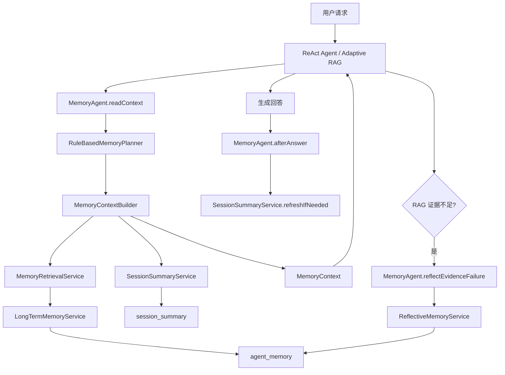

# Memory Agent 完整技术实现文档

## 1. 背景与目标

InfiniteChat-Agent 已经具备 ReAct Agent、Adaptive RAG、Hybrid Search、Rerank、Evidence Evaluator、Query Rewrite 等能力。Memory Agent 阶段的目标是让 Agent 从“单轮检索问答”升级为“具备长期上下文、用户偏好、反思学习和可观测记忆链路的智能体”。

Memory Agent 解决的问题：

- Redis 短期窗口只能保存最近消息，无法支撑长程对话。
- 长对话全部放入 Prompt 会导致 Token 成本升高。
- 不同 session 之间无法复用用户偏好和项目背景。
- RAG 失败或用户纠正后，系统无法沉淀经验。
- ReAct / Adaptive RAG 对记忆能力的调用分散，缺少统一编排。

最终实现：

- Redis 短期记忆。
- MySQL 会话摘要记忆。
- MySQL 长期用户记忆。
- 相关记忆动态注入。
- Reflective Memory 反思记忆。
- MemoryAgent 统一编排。
- MemoryTrace 可观测链路。

## 2. 总体架构



## 3. 数据库设计

### 3.1 session_summary

由 `MemorySchemaInitializer` 自动创建。

```sql
create table if not exists session_summary (
    id bigint primary key auto_increment,
    user_id bigint not null,
    session_id bigint not null,
    summary text not null,
    turn_count int not null default 0,
    last_message_at datetime null,
    created_at timestamp default current_timestamp,
    updated_at timestamp default current_timestamp on update current_timestamp,
    unique key uk_session_summary (user_id, session_id)
) engine=InnoDB default charset=utf8mb4;
```

作用：

- 保存一个 session 的长期摘要。
- 避免把完整历史对话塞进 Prompt。
- 支持多轮任务延续。

### 3.2 agent_memory

由 `MemorySchemaInitializer` 自动创建。

```sql
create table if not exists agent_memory (
    id bigint primary key auto_increment,
    memory_id varchar(128) not null unique,
    user_id bigint not null,
    session_id bigint null,
    memory_type varchar(64) not null,
    content text not null,
    summary varchar(512) null,
    confidence double not null default 0.8,
    source varchar(64) not null,
    status varchar(32) not null default 'ACTIVE',
    expires_at datetime null,
    created_at timestamp default current_timestamp,
    updated_at timestamp default current_timestamp on update current_timestamp
) engine=InnoDB default charset=utf8mb4;
```

索引：

```sql
idx_agent_memory_user_type(user_id, memory_type)
idx_agent_memory_session(session_id)
idx_agent_memory_status(status)
```

作用：

- 保存用户长期偏好。
- 保存项目背景。
- 保存技术栈信息。
- 保存输出风格。
- 保存重要事实。
- 保存反思记忆。

## 4. 核心类型

### 4.1 MemoryType

```java
public enum MemoryType {
    USER_PREFERENCE,
    PROJECT_CONTEXT,
    TECH_STACK,
    OUTPUT_STYLE,
    IMPORTANT_FACT,
    REFLECTION
}
```

### 4.2 MemoryStatus

```java
public enum MemoryStatus {
    ACTIVE,
    DISABLED,
    EXPIRED
}
```

### 4.3 ReflectionTrigger

```java
public enum ReflectionTrigger {
    EVIDENCE_INSUFFICIENT,
    RETRIEVAL_FAILED,
    USER_CORRECTION,
    TOOL_FAILED,
    LOW_CONFIDENCE
}
```

## 5. 核心模块实现

### 5.1 MemorySchemaInitializer

位置：

```text
src/main/java/com/lou/infinitechatagent/memory/MemorySchemaInitializer.java
```

职责：

- 项目启动时自动创建 `session_summary`。
- 项目启动时自动创建 `agent_memory`。
- 自动补充必要索引。

价值：

- 本地启动即可初始化 Memory 所需表结构。
- 降低测试和部署成本。

### 5.2 SessionSummaryService

位置：

```text
src/main/java/com/lou/infinitechatagent/memory/SessionSummaryService.java
```

职责：

- 查询 session 摘要。
- 从 Redis ChatMemory 读取最近消息。
- 每 N 条消息自动触发摘要刷新。
- 使用 LLM 合并旧摘要和最近对话。

关键配置：

```yaml
memory:
  summary:
    trigger-turns: 6
    window-messages: 30
    max-output-tokens: 500
```

核心流程：

```text
Redis 最近消息 -> LLM 摘要 -> upsert session_summary -> 后续 Prompt 注入摘要
```

摘要模板保留：

- 用户当前目标。
- 已完成事项。
- 未完成事项。
- 技术约束。
- 用户偏好。

### 5.3 LongTermMemoryService

位置：

```text
src/main/java/com/lou/infinitechatagent/memory/LongTermMemoryService.java
```

职责：

- 写入长期记忆。
- 查询用户长期记忆。
- 按 memoryType 查询。
- 禁用记忆。
- 过滤过期记忆。

写入逻辑：

```java
String memoryId = "mem_" + UUID.randomUUID().toString().replace("-", "");
MemoryType memoryType = request.getMemoryType() == null
        ? MemoryType.IMPORTANT_FACT
        : request.getMemoryType();
double confidence = request.getConfidence() == null ? 0.8 : request.getConfidence();
String source = StringUtils.hasText(request.getSource()) ? request.getSource() : "manual";
```

查询逻辑：

```text
where user_id = ?
  and status = 'ACTIVE'
  and (expires_at is null or expires_at > now())
order by confidence desc, updated_at desc
limit ?
```

### 5.4 MemoryRetrievalService

位置：

```text
src/main/java/com/lou/infinitechatagent/memory/MemoryRetrievalService.java
```

职责：

- 根据当前 prompt 从长期记忆中筛选相关记忆。
- 控制注入 TopK。
- 控制 memory char budget。

配置：

```yaml
memory:
  context:
    max-memory-items: 5
    max-memory-chars: 1200
    min-relevance-score: 0.08
```

评分因素：

- `confidence` 基础分。
- prompt 和 memory 的关键词重合率。
- memoryType boost。

类型 boost 示例：

- 问“技术栈 / Java / Spring / Redis”时提升 `TECH_STACK`。
- 问“文档 / Postman / 简历 / 输出”时提升 `OUTPUT_STYLE`。
- 问“项目 / Agent / RAG / Memory”时提升 `PROJECT_CONTEXT`。
- 问“失败 / 优化 / 策略”时提升 `REFLECTION`。

### 5.5 MemoryContextBuilder

位置：

```text
src/main/java/com/lou/infinitechatagent/memory/MemoryContextBuilder.java
```

职责：

- 读取 session summary。
- 读取相关长期记忆。
- 组装 `MemoryContext`。
- 估算 memory token。

返回结构：

```json
{
  "summaryInjected": true,
  "sessionSummary": "...",
  "longTermMemoryInjected": true,
  "longTermMemories": [],
  "usedMemoryCount": 3,
  "estimatedMemoryTokens": 260
}
```

### 5.6 ReflectiveMemoryService

位置：

```text
src/main/java/com/lou/infinitechatagent/memory/ReflectiveMemoryService.java
```

职责：

- 监听证据不足。
- 监听多轮检索失败。
- 支持用户纠正反思。
- 支持工具失败反思。
- 将反思写入 `agent_memory`，类型为 `REFLECTION`。

配置：

```yaml
memory:
  reflection:
    enabled: true
    min-confidence: 0.55
```

自动反思触发：

```text
Adaptive RAG hit=false -> MemoryAgent.reflectEvidenceFailure -> ReflectiveMemoryService -> agent_memory REFLECTION
```

### 5.7 MemoryAgent

位置：

```text
src/main/java/com/lou/infinitechatagent/memory/MemoryAgent.java
```

职责：

- 统一记忆读取。
- 统一回答后摘要刷新。
- 统一反思写入。
- 返回 MemoryTrace。

核心方法：

```java
MemoryTrace readContext(Long userId, Long sessionId, String prompt);

MemoryTrace afterAnswer(Long userId, Long sessionId, String prompt);

MemoryTrace reflectEvidenceFailure(
        Long userId,
        Long sessionId,
        String prompt,
        EvidenceEvaluation evaluation,
        int rounds
);
```

### 5.8 RuleBasedMemoryPlanner

位置：

```text
src/main/java/com/lou/infinitechatagent/memory/RuleBasedMemoryPlanner.java
```

职责：

- 判断是否读取记忆。
- 判断读取哪些记忆。
- 判断回答后是否刷新摘要。
- 预留后续 LLM Memory Planner 扩展空间。

规则：

- 有 `sessionId`：读取 `SESSION_SUMMARY`。
- 有 `userId`：读取 `LONG_TERM_MEMORY` 和 `REFLECTION`。
- 有 `userId + sessionId`：允许刷新摘要。
- prompt 包含“继续 / 上面 / 刚刚 / 之前 / 我的项目”等上下文表达时，增强读取记忆倾向。

返回示例：

```json
{
  "needReadMemory": true,
  "readTypes": [
    "SESSION_SUMMARY",
    "LONG_TERM_MEMORY",
    "REFLECTION"
  ],
  "needWriteSummary": true,
  "needWriteReflection": false,
  "reason": "存在 userId 和 sessionId，读取会话摘要、长期记忆和反思记忆，并在回答后按需刷新摘要。"
}
```

## 6. 与 ReAct Agent 集成

位置：

```text
src/main/java/com/lou/infinitechatagent/agent/ReActAgentOrchestrator.java
```

调用链：

```text
chat -> MemoryAgent.readContext -> Planner -> Action -> Answer -> MemoryAgent.afterAnswer
```

关键变化：

- ReAct 不再直接依赖 `SessionSummaryService`。
- ReAct 不再直接依赖 `MemoryContextBuilder`。
- 统一通过 `MemoryAgent` 获取记忆上下文。

Prompt 注入格式：

```text
记忆上下文：
会话摘要：
...

长期记忆：
- [TECH_STACK] ...
- [OUTPUT_STYLE] ...

用户问题：
...
```

## 7. 与 Adaptive RAG 集成

位置：

```text
src/main/java/com/lou/infinitechatagent/rag/adaptive/AdaptiveRagOrchestrator.java
```

调用链：

```text
chat -> MemoryAgent.readContext -> RetrievalPlanner -> Retrieval -> EvidenceEvaluator
```

命中时：

```text
生成引用回答 -> save Redis memory -> MemoryAgent.afterAnswer
```

未命中时：

```text
生成拒答 -> MemoryAgent.reflectEvidenceFailure -> save Redis memory -> MemoryAgent.afterAnswer
```

Debug 返回：

```json
{
  "debug": {
    "memoryContext": {},
    "memoryTrace": {
      "decision": {},
      "context": {},
      "summaryRefreshed": true,
      "reflection": {},
      "costMs": 5
    },
    "reflection": {}
  }
}
```

## 8. API 接口总览

基础路径：

```text
http://localhost:10010/api
```

### 8.1 查询 session summary

```http
GET /memory/session/summary?userId=1001&sessionId=93001
```

### 8.2 手动生成 session summary

```http
POST /memory/session/summarize
```

```json
{
  "userId": 1001,
  "sessionId": 93001
}
```

### 8.3 写入长期记忆

```http
POST /memory/write
```

```json
{
  "userId": 1001,
  "sessionId": 93001,
  "memoryType": "TECH_STACK",
  "content": "用户的 Agent 项目核心技术栈是 Spring Boot 3、Java 17、LangChain4j、Redis、MySQL、Qwen、Prometheus 和 Grafana。",
  "summary": "Agent 项目技术栈：Spring Boot 3、Java 17、LangChain4j、Redis、MySQL、Qwen、Prometheus、Grafana。",
  "confidence": 0.95,
  "source": "manual"
}
```

### 8.4 查询用户长期记忆

```http
GET /memory/user/1001?limit=10
```

### 8.5 按类型查询长期记忆

```http
GET /memory/user/1001?memoryType=REFLECTION&limit=10
```

### 8.6 查询单条记忆

```http
GET /memory/item/{memoryId}
```

### 8.7 禁用记忆

```http
POST /memory/disable/{memoryId}
```

### 8.8 构建 MemoryContext

```http
POST /memory/context
```

```json
{
  "userId": 1001,
  "sessionId": 93001,
  "prompt": "请概括我的 Agent 项目技术栈"
}
```

### 8.9 手动写入反思

```http
POST /memory/reflection
```

```json
{
  "userId": 1001,
  "sessionId": 93001,
  "trigger": "USER_CORRECTION",
  "prompt": "纠正一下，我的 Agent 项目数据库现在主要是 MySQL，不是 PostgreSQL。",
  "reason": "用户纠正项目技术栈信息",
  "confidence": 0.92
}
```

### 8.10 查看 MemoryAgent 决策

```http
POST /memory/agent/context
```

```json
{
  "userId": 1001,
  "sessionId": 93001,
  "prompt": "继续优化我的 Agent 项目 Memory 部分"
}
```

### 8.11 ReAct Agent 测试

```http
POST /agent/chat
```

```json
{
  "userId": 1001,
  "sessionId": 93001,
  "prompt": "我现在 Memory Agent 阶段做到哪一步了？"
}
```

### 8.12 Adaptive RAG Debug 测试

```http
POST /rag/adaptive/chat
```

```json
{
  "userId": 1001,
  "sessionId": 93001,
  "prompt": "请根据记忆说明我当前 Agent 项目的优化重点。",
  "debug": true
}
```

## 9. 推荐测试流程

1. 调用 `/memory/write` 写入 `TECH_STACK`。
2. 调用 `/memory/write` 写入 `PROJECT_CONTEXT`。
3. 调用 `/memory/write` 写入 `OUTPUT_STYLE`。
4. 调用 `/memory/context` 验证相关记忆注入。
5. 调用 `/memory/agent/context` 验证 MemoryDecision。
6. 调用 `/agent/chat` 验证 ReAct 使用记忆。
7. 调用 `/rag/adaptive/chat debug=true` 验证 Adaptive RAG 返回 `memoryTrace`。
8. 调用 `/memory/reflection` 模拟用户纠正。
9. 调用 `/memory/user/1001?memoryType=REFLECTION` 查询反思。
10. 调用一个知识库无法回答的问题，验证 Adaptive RAG 自动写反思。

## 10. 简历表达

完整版本：

> 设计并实现 Memory Agent 记忆增强模块，在 Redis 短期会话记忆基础上，引入 Session Summary 摘要记忆、MySQL 长期用户记忆、相关记忆动态注入与 Reflective Memory 反思机制；通过 RuleBased Memory Planner 统一判断记忆读取、摘要刷新和反思写入时机，并以 MemoryTrace 暴露记忆决策、注入内容、Token 估算和反思写入结果，使 ReAct Agent 与 Adaptive RAG 共享同一套记忆编排能力，提升跨会话连续性、个性化回答能力和 Agent 可观测性。

简短版本：

> 构建 Memory Agent 统一编排层，融合 Redis 短期记忆、会话摘要、长期用户记忆、相关记忆注入与反思记忆，并通过 MemoryTrace 暴露记忆读写决策链路，增强 Agent 的跨会话连续性和自我优化能力。

## 11. 后续可优化方向

- 引入 LLM Memory Planner，让模型判断是否读写记忆。
- 对长期记忆做相似度去重和合并。
- 对敏感信息写入做安全拦截。
- 引入 memory embedding，支持语义检索长期记忆。
- 增加 memory audit log，记录每次记忆读写来源。
- 支持用户手动确认高风险记忆写入。
