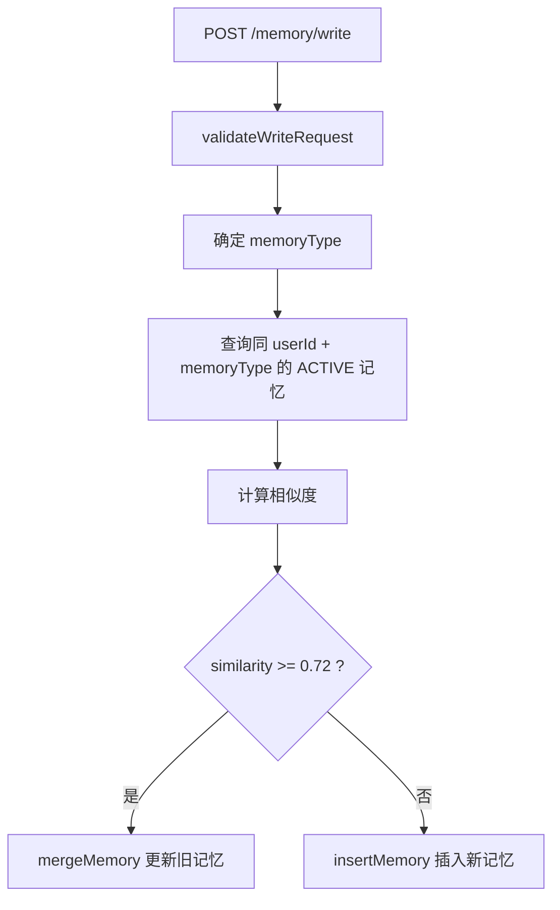
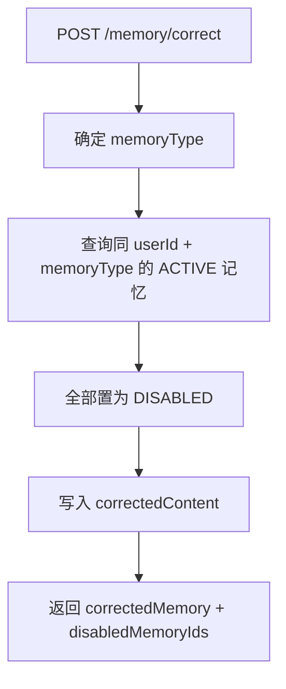

# Memory 去重与纠错技术实现细节

## 1. 为什么要做 Memory 去重与纠错

Memory Agent 已经支持长期记忆写入，例如：

- `TECH_STACK`
- `PROJECT_CONTEXT`
- `OUTPUT_STYLE`
- `USER_PREFERENCE`
- `REFLECTION`

如果每次用户表达类似内容都直接插入一条新 memory，会出现两个问题：

1. **记忆膨胀**

   同一个用户的技术栈、项目背景、输出偏好会被重复写入多次，后续构建 MemoryContext 时会引入重复内容，增加 Token 成本。

2. **记忆污染**

   用户纠正信息后，旧记忆仍然处于 ACTIVE 状态，后续可能把错误旧事实继续注入 Prompt。

因此本阶段做了两件事：

- 写入时自动去重/合并相似记忆。
- 用户纠错时禁用旧记忆，并写入高置信新记忆。

## 2. 涉及文件

```text
src/main/java/com/lou/infinitechatagent/memory/
├─ LongTermMemoryService.java
└─ dto/
   ├─ MemoryCorrectionRequest.java
   └─ MemoryCorrectionResult.java

src/main/java/com/lou/infinitechatagent/controller/
└─ MemoryController.java
```

## 3. 写入去重实现

### 3.1 接口入口

接口：

```http
POST /api/memory/write
```

Controller：

```java
@PostMapping("/write")
public MemoryItem writeMemory(@RequestBody MemoryWriteRequest request) {
    return longTermMemoryService.write(request);
}
```

Service：

```java
public MemoryItem write(MemoryWriteRequest request) {
    return writeWithDedup(request);
}
```

也就是说，原来的写入接口不变，但内部默认走去重逻辑。

## 4. 去重主流程

核心方法：

```java
public MemoryItem writeWithDedup(MemoryWriteRequest request) {
    validateWriteRequest(request);
    MemoryType memoryType = request.getMemoryType() == null
            ? MemoryType.IMPORTANT_FACT
            : request.getMemoryType();
    Optional<MemoryItem> similarMemory = findMostSimilarMemory(
            request.getUserId(),
            memoryType,
            request.getContent()
    );
    if (similarMemory.isPresent()) {
        return mergeMemory(similarMemory.get(), request);
    }
    return insertMemory(request, memoryType);
}
```

流程：



## 5. 相似记忆查找

核心方法：

```java
private Optional<MemoryItem> findMostSimilarMemory(
        Long userId,
        MemoryType memoryType,
        String content
) {
    if (userId == null || memoryType == null || !StringUtils.hasText(content)) {
        return Optional.empty();
    }
    return findActiveByUser(userId, memoryType, 20).stream()
            .map(memory -> new SimilarMemory(memory, similarity(memoryText(memory), content)))
            .filter(similar -> similar.score() >= 0.72)
            .max((left, right) -> Double.compare(left.score(), right.score()))
            .map(SimilarMemory::memory);
}
```

查询范围：

- 同一个 `userId`
- 同一个 `memoryType`
- 只查询 `ACTIVE` 状态
- 最多取 20 条候选

为什么限制同类型？

因为不同类型的记忆语义用途不同：

- `TECH_STACK` 不能和 `OUTPUT_STYLE` 合并。
- `PROJECT_CONTEXT` 不能和 `REFLECTION` 合并。

这样可以减少误合并。

## 6. 相似度算法

当前实现是轻量规则版 Jaccard Similarity。

### 6.1 文本来源

```java
private String memoryText(MemoryItem memory) {
    if (memory == null) {
        return "";
    }
    return (StringUtils.hasText(memory.getSummary())
            ? memory.getSummary()
            : memory.getContent());
}
```

优先使用 `summary`，因为 summary 更短、更适合判断记忆主题。

### 6.2 分词

```java
private Set<String> tokenize(String text) {
    Set<String> tokens = new LinkedHashSet<>();
    if (!StringUtils.hasText(text)) {
        return tokens;
    }
    for (String token : text.toLowerCase().split("[\\s,，。.!！?？:：;；/\\\\|()（）\\[\\]{}<>《》\"'`+-]+")) {
        if (token.length() >= 2) {
            tokens.add(token);
        }
    }
    return tokens;
}
```

处理方式：

- 转小写。
- 按中英文标点、空格、括号等切分。
- 过滤长度小于 2 的 token。
- 使用 `Set` 去重。

### 6.3 Jaccard Similarity

```java
private double similarity(String left, String right) {
    Set<String> leftTokens = tokenize(left);
    Set<String> rightTokens = tokenize(right);
    if (leftTokens.isEmpty() || rightTokens.isEmpty()) {
        return 0;
    }
    Set<String> intersection = new LinkedHashSet<>(leftTokens);
    intersection.retainAll(rightTokens);
    Set<String> union = new LinkedHashSet<>(leftTokens);
    union.addAll(rightTokens);
    return (double) intersection.size() / union.size();
}
```

公式：

```text
similarity = intersection(tokensA, tokensB) / union(tokensA, tokensB)
```

阈值：

```java
similar.score() >= 0.72
```

含义：

- 大于等于 `0.72` 认为是同类重复记忆。
- 小于 `0.72` 认为是新信息，插入新 memory。

## 7. 相似时如何合并

核心方法：

```java
private MemoryItem mergeMemory(MemoryItem existing, MemoryWriteRequest request) {
    String mergedContent = mergeText(existing.getContent(), request.getContent());
    String mergedSummary = StringUtils.hasText(request.getSummary())
            ? request.getSummary().strip()
            : existing.getSummary();
    double mergedConfidence = Math.max(
            existing.getConfidence() == null ? 0.8 : existing.getConfidence(),
            request.getConfidence() == null ? 0.8 : request.getConfidence()
    );
    String source = StringUtils.hasText(request.getSource())
            ? "merged:" + request.getSource().strip()
            : "merged";
    ragJdbcTemplate.update("""
            update agent_memory
            set session_id = coalesce(?, session_id),
                content = ?,
                summary = ?,
                confidence = ?,
                source = ?,
                expires_at = ?,
                updated_at = now()
            where memory_id = ?
            """,
            request.getSessionId(),
            mergedContent,
            normalizeBlank(mergedSummary),
            mergedConfidence,
            source,
            toTimestamp(request.getExpiresAt()),
            existing.getMemoryId());
    return findByMemoryId(existing.getMemoryId())
            .orElseThrow(() -> new IllegalStateException("长期记忆合并失败"));
}
```

合并策略：

| 字段 | 策略 |
| --- | --- |
| `memory_id` | 保留旧 memoryId，不新增 |
| `content` | 合并旧内容与新内容 |
| `summary` | 如果新请求带 summary，则使用新 summary |
| `confidence` | 取旧值和新值的最大值 |
| `source` | 标记为 `merged:xxx` |
| `updated_at` | 更新为当前时间 |
| `status` | 保持 ACTIVE |

## 8. content 合并策略

```java
private String mergeText(String existing, String incoming) {
    if (!StringUtils.hasText(existing)) {
        return incoming == null ? "" : incoming.strip();
    }
    if (!StringUtils.hasText(incoming)) {
        return existing.strip();
    }
    String safeExisting = existing.strip();
    String safeIncoming = incoming.strip();
    if (safeExisting.contains(safeIncoming)) {
        return safeExisting;
    }
    if (safeIncoming.contains(safeExisting)) {
        return safeIncoming;
    }
    return safeExisting + "\n补充：" + safeIncoming;
}
```

逻辑：

1. 如果旧内容为空，使用新内容。
2. 如果新内容为空，保留旧内容。
3. 如果旧内容已经包含新内容，保留旧内容。
4. 如果新内容包含旧内容，使用新内容。
5. 否则把新内容作为“补充”追加。

示例：

旧内容：

```text
用户项目技术栈是 Spring Boot、Java、Redis。
```

新内容：

```text
用户项目技术栈是 Spring Boot、Java、Redis、MySQL。
```

结果：

```text
用户项目技术栈是 Spring Boot、Java、Redis、MySQL。
```

如果两者不完全包含：

```text
旧内容
补充：新内容
```

## 9. 不相似时插入新记忆

```java
private MemoryItem insertMemory(MemoryWriteRequest request, MemoryType memoryType) {
    String memoryId = "mem_" + UUID.randomUUID().toString().replace("-", "");
    double confidence = request.getConfidence() == null ? 0.8 : request.getConfidence();
    String source = StringUtils.hasText(request.getSource())
            ? request.getSource()
            : "manual";
    ...
}
```

新记忆默认：

- `status = ACTIVE`
- `confidence = 0.8`
- `source = manual`
- `memory_id = mem_xxx`

## 10. 用户纠错实现

### 10.1 接口

```http
POST /api/memory/correct
```

请求体：

```json
{
  "userId": 1001,
  "sessionId": 96001,
  "memoryType": "TECH_STACK",
  "correctedContent": "用户的 Agent 项目数据库主要使用 MySQL 和 PgVector，其中 MySQL 存业务表，PgVector 存向量数据。",
  "correctedSummary": "数据库纠正：MySQL 存业务表，PgVector 存向量数据。",
  "reason": "用户纠正旧技术栈描述",
  "confidence": 0.98
}
```

### 10.2 DTO

`MemoryCorrectionRequest`：

```java
@Data
public class MemoryCorrectionRequest {

    private Long userId;

    private Long sessionId;

    private MemoryType memoryType;

    private String correctedContent;

    private String correctedSummary;

    private String reason;

    private Double confidence;
}
```

`MemoryCorrectionResult`：

```java
@Data
@Builder
@NoArgsConstructor
@AllArgsConstructor
public class MemoryCorrectionResult {

    private MemoryItem correctedMemory;

    private List<String> disabledMemoryIds;

    private String reason;
}
```

## 11. 纠错 Controller 流程

```java
@PostMapping("/correct")
public MemoryCorrectionResult correctMemory(@RequestBody MemoryCorrectionRequest request) {
    MemoryType memoryType = request.getMemoryType() == null
            ? MemoryType.IMPORTANT_FACT
            : request.getMemoryType();
    List<String> disabledMemoryIds = longTermMemoryService.disableActiveByType(
            request.getUserId(),
            memoryType
    );
    MemoryItem correctedMemory = longTermMemoryService.correct(request);
    return MemoryCorrectionResult.builder()
            .correctedMemory(correctedMemory)
            .disabledMemoryIds(disabledMemoryIds)
            .reason(request.getReason())
            .build();
}
```

流程：



## 12. 禁用旧记忆

```java
public List<String> disableActiveByType(Long userId, MemoryType memoryType) {
    if (userId == null || memoryType == null) {
        return List.of();
    }
    List<String> memoryIds = findActiveByUser(userId, memoryType, 20).stream()
            .map(MemoryItem::getMemoryId)
            .toList();
    memoryIds.forEach(this::disable);
    return memoryIds;
}
```

禁用逻辑：

```java
update agent_memory
set status = 'DISABLED', updated_at = now()
where memory_id = ? and status = 'ACTIVE'
```

为什么是禁用而不是删除？

- 保留审计痕迹。
- 后续可以回溯用户纠正前后差异。
- 防止误删重要记忆。

## 13. 写入纠正后新记忆

```java
public MemoryItem correct(MemoryCorrectionRequest request) {
    ...
    MemoryWriteRequest writeRequest = new MemoryWriteRequest();
    writeRequest.setUserId(request.getUserId());
    writeRequest.setSessionId(request.getSessionId());
    writeRequest.setMemoryType(memoryType);
    writeRequest.setContent(request.getCorrectedContent());
    writeRequest.setSummary(request.getCorrectedSummary());
    writeRequest.setConfidence(request.getConfidence() == null ? 0.95 : request.getConfidence());
    writeRequest.setSource("correction");
    return insertMemory(writeRequest, memoryType);
}
```

纠正记忆特点：

- `source = correction`
- 默认 `confidence = 0.95`
- 不走去重合并，直接插入新事实。
- 旧同类型 ACTIVE 记忆已经被禁用。

## 14. 关键设计取舍

### 14.1 为什么去重只在同 memoryType 内做？

因为不同类型记忆用途不同。

例如：

- `TECH_STACK` 关注技术栈。
- `OUTPUT_STYLE` 关注输出偏好。
- `REFLECTION` 关注失败经验。

跨类型合并会导致语义污染。

### 14.2 为什么纠错禁用同类型全部 ACTIVE？

这是偏保守的策略。

用户明确说“纠正一下”时，通常说明当前类型下已有事实不可靠。禁用同类型旧记忆可以最大限度避免错误事实继续注入 Prompt。

后续可以优化成：

- 只禁用相似旧记忆。
- 只降低旧记忆 confidence。
- 记录 conflict group。

### 14.3 为什么当前不用 embedding 相似度？

当前实现是轻量规则版，优点：

- 不增加模型调用成本。
- 不依赖额外向量表。
- 可解释性强。
- 适合简历项目快速展示。

后续可升级：

- `agent_memory_embedding`
- embedding 召回相似 memory
- LLM 判断是否冲突

## 15. 验收流程

Postman 文件：

```text
E:\Java\Agent\InfiniteChat-Agent-Docs\优化\03-Memory-Agent\Memory-去重与纠错接口测试.postman_collection.json
```

推荐流程：

1. 写入一条 `TECH_STACK` 记忆。
2. 再写入一条相似 `TECH_STACK` 记忆。
3. 查询 `TECH_STACK`，观察是否没有明显重复膨胀。
4. 调用 `/memory/correct` 写入纠正事实。
5. 再查 `TECH_STACK`，只应返回纠正后的 ACTIVE 记忆。
6. 调用 `/memory/context`，验证注入的是纠正后的记忆。

## 16. 简历表达

> 设计长期记忆去重与纠错机制，在 Memory 写入时基于同用户、同类型候选记忆进行 Jaccard 相似度判断，相似记忆自动合并更新而非重复插入；同时提供用户纠错接口，对冲突旧记忆进行软禁用并写入高置信新事实，降低长期记忆膨胀和错误记忆污染风险。

## 17. 后续优化方向

- 将相似度阈值做成配置项。
- 使用 embedding 检索相似长期记忆。
- 引入 LLM 判断新旧记忆是补充、重复还是冲突。
- 增加 `conflict_group_id`，记录纠错链路。
- 对旧记忆不直接禁用，而是降低 confidence。
- 增加 Memory Audit Log，记录每次合并和纠错动作。
